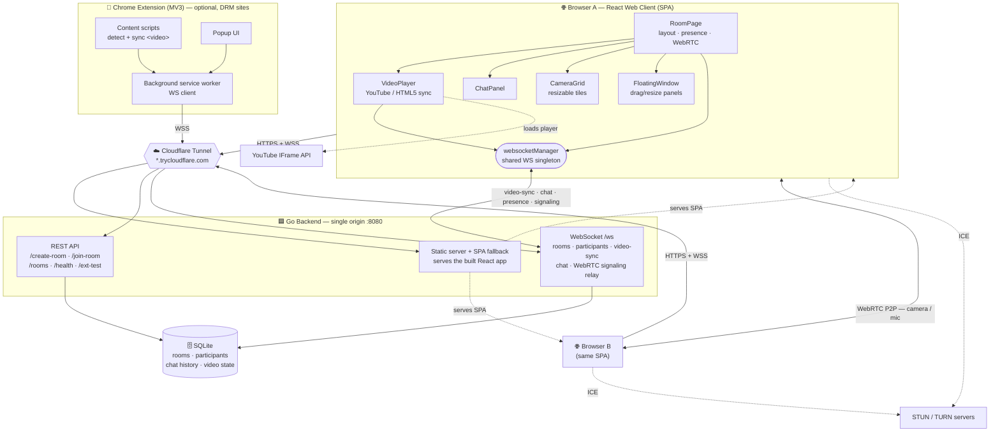
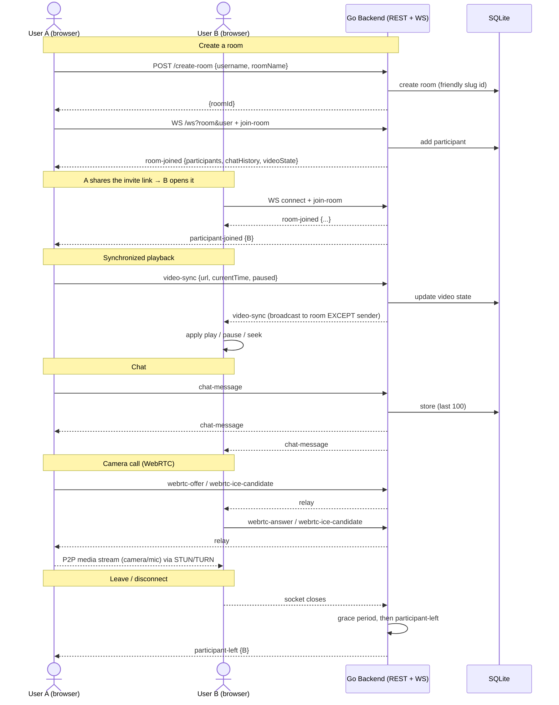
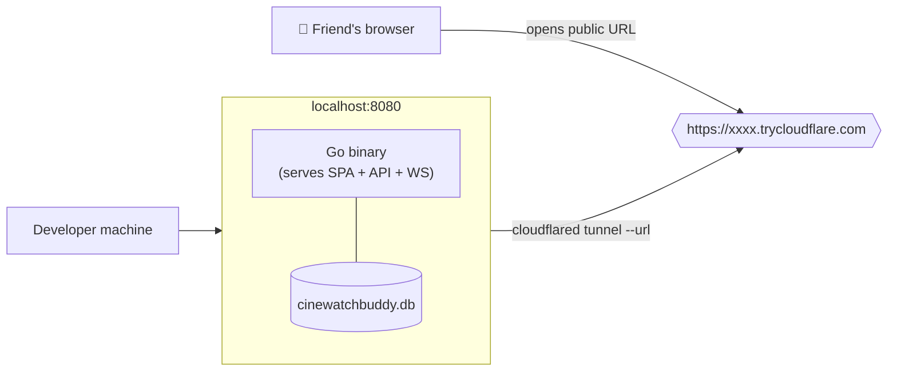

# CineWatchBuddy — System Architecture

CineWatchBuddy is a synchronized watch‑party app. A **Go backend** serves the
**React web client** from a single origin, relays real‑time events over
**WebSockets**, and stores room state in **SQLite**. Camera/mic uses
**peer‑to‑peer WebRTC** (the backend only relays signaling). An optional
**Chrome extension** brings sync to DRM streaming sites.

---

## Component architecture

**Key points**

- **Single origin.** The Go server serves the built SPA *and* the REST + WS API,
  so one Cloudflare Tunnel URL exposes everything. The client derives its API/WS
  URLs from `window.location.origin` (http→ws, https→wss) — no hardcoded host.
- **WebSocket is the real‑time bus.** One shared connection per browser
  (`websocketManager`) carries room join, presence, chat, video sync, and WebRTC
  signaling.
- **Media is peer‑to‑peer.** Camera/mic never touches the backend; the backend
  only relays offer/answer/ICE. STUN/TURN handle NAT traversal.
- **The extension is optional** and independent — a thin bridge for DRM sites; the
  web client alone covers YouTube/Vimeo/direct URLs.

---

## Watch‑party message flow

---

## WebSocket message types

| Type | Direction | Purpose |
|---|---|---|
| `join-room` | client → server | Register as a participant (sent on connect/reconnect) |
| `room-joined` | server → client | Initial state: participants, chat history, video state |
| `participant-joined` / `participant-left` | server → room | Presence (leave is delayed by a grace period) |
| `video-sync` | client → server → room* | Play / pause / seek / url (*broadcast to everyone **except the sender**) |
| `chat-message` | client → server → room | Chat + join/leave system notices |
| `webrtc-offer` / `webrtc-answer` / `webrtc-ice-candidate` | client → server → room | WebRTC signaling relay (media stays P2P) |
| `webrtc-call-started` / `webrtc-call-ended` | client → server → room | Camera on/off notifications |
| `ping` / `pong` | both | Keep‑alive |

---

## Components at a glance

| Component | Tech | Responsibility |
|---|---|---|
| **Web client** | React + Vite + Tailwind | UI: landing, room, resizable/floating Camera & Chat panels, `VideoPlayer`, `CameraGrid` |
| `websocketManager` | JS singleton | One shared WS per browser; reconnect with backoff; origin‑based URL |
| **Backend** | Go (`net/http`, gorilla/websocket) | REST rooms, WS hub, per‑connection serialized writes, static SPA serving |
| **Database** | SQLite (`mattn/go-sqlite3`) | Rooms, participants, chat history, video state |
| **WebRTC** | Browser RTCPeerConnection | P2P camera/mic; perfect‑negotiation; STUN + TURN |
| **Extension** | Chrome MV3 | Background WS client + content scripts to sync DRM `<video>` elements |
| **Tunnel** | Cloudflare `cloudflared` | Public HTTPS/WSS URL to the local backend |

---

## Deployment shape

Single lightweight Go binary + one SQLite file. For public testing, `cloudflared`
exposes it; for production it can sit behind any TLS reverse proxy (same single
origin).
