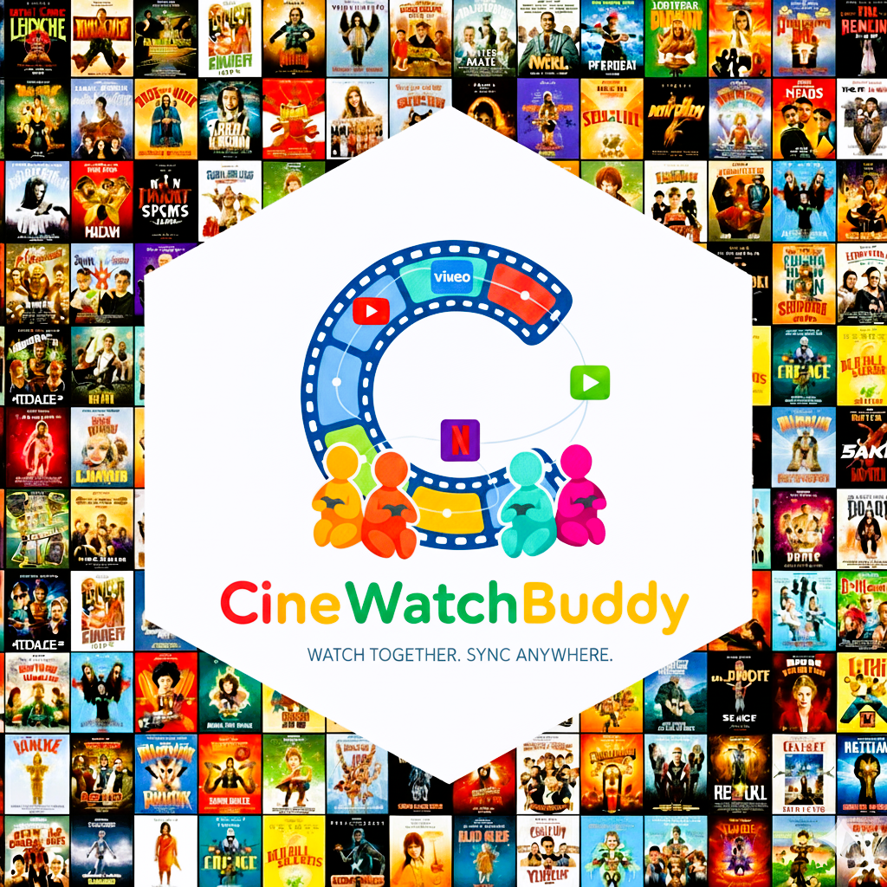
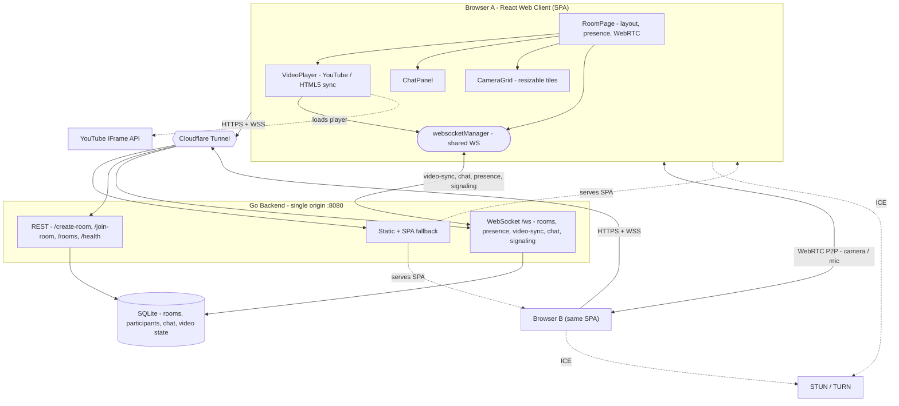

# CineWatchBuddy



A watch‑party app: a **React web client** served by a **Go backend** that keeps
video playback, chat, and camera/mic in sync with friends in real time. Works
with YouTube, Vimeo, and direct video URLs out of the box; an optional Chrome
extension adds sync for DRM sites (Netflix, Disney+, Prime Video, …).

## Features

- **Synchronized Playback** — play / pause / seek stay in sync for everyone in the room (YouTube, Vimeo, and direct video URLs in the web app)
- **Friendly Rooms** — create a room with a memorable name (e.g. `movie-night`) and share it or the invite link; up to 15 people per room
- **Real-time Chat** — chat while you watch, with persistent history that survives toggling the panel
- **Voice / Video Chat** — peer-to-peer WebRTC camera & mic in a camera grid you can resize per participant (e.g. 70/30, not a fixed split)
- **Flexible UI** — floating, draggable, resizable, collapsible Camera and Chat panels beside the video
- **Share Publicly** — expose your local server with one Cloudflare Tunnel URL; friends just open the link (no install, no localhost)
- **DRM Companion** — optional Chrome extension syncs playback on Netflix / Disney+ / Prime Video, etc.

## Architecture

> 📐 **See [ARCHITECTURE.md](ARCHITECTURE.md)** for rendered diagrams — a component
> graph, the watch‑party message flow, and the deployment shape.

- **Web Client**: React SPA served by the Go backend (single origin)
- **Backend**: Go WebSocket + REST server; SQLite for room / chat / video state
- **Sync Protocol**: real‑time events over one shared WebSocket (`video-sync` is broadcast to everyone **except the sender** to avoid echo)
- **Video Calls**: peer‑to‑peer WebRTC (camera/mic) with STUN + TURN; the backend only relays signaling
- **Public Access**: Cloudflare Tunnel provides a shareable HTTPS / WSS URL
- **Chrome Extension**: optional MV3 companion for DRM streaming sites

## Project Structure

```
CineWatchBuddy/
├── src/
│   ├── extension/          # Chrome Extension (Manifest V3)
│   │   ├── background/     # Service Worker
│   │   ├── content/        # Content Scripts
│   │   ├── popup/          # Extension Popup UI
│   │   ├── components/     # Shared Components
│   │   └── manifest.json   # Extension Manifest
│   ├── web/               # React Web Client
│   │   ├── src/
│   │   │   ├── components/ # React Components
│   │   │   └── main.jsx    # App Entry Point
│   │   └── package.json    # Frontend Dependencies
│   └── server/            # Go Backend Server
│       ├── main.go        # WebSocket Server
│       └── go.mod         # Go Dependencies
├── assets/
│   └── icons/            # Logo and Assets
├── scripts/
│   └── build.js          # Build Script
└── dist/                 # Built Extension (Generated)
```

## Architecture Diagram

High‑level component view. The full set — this graph plus the watch‑party
**message‑flow sequence** and the **deployment shape** — lives in
**[ARCHITECTURE.md](ARCHITECTURE.md)** and renders inline on GitHub.



## How to Use

Follow these steps to clone the repo and run a watch party locally.

### Prerequisites

- **Node.js 18+** and npm (developed on Node 20/26)
- **Go 1.21+** with a C compiler available — the backend stores state in SQLite via CGO:
  - macOS: `xcode-select --install`
  - Debian/Ubuntu: `sudo apt install build-essential`
  - Windows: a gcc toolchain such as [TDM-GCC](https://jmeubank.github.io/tdm-gcc/) or MinGW-w64
- **Google Chrome** (only required for the optional browser extension)

### 1. Clone and install dependencies

```bash
git clone <repository-url>
cd CineWatchBuddy
npm run install-deps        # installs root deps, Go modules, and web-client deps
```

> `install-deps` is a shortcut for: `npm install` &nbsp;+&nbsp; `cd src/server && go mod tidy` &nbsp;+&nbsp; `cd src/web && npm install`.
>
> On recent npm versions the web client's `esbuild`/`vite` install script may be blocked. If step 3 later fails with an esbuild error, run:
> ```bash
> cd src/web
> npm approve-scripts --allow-scripts-pending   # allow esbuild + fsevents
> npm rebuild esbuild
> ```

### 2. Start the backend (Terminal 1)

```bash
npm run start-backend
```

Runs the Go WebSocket + REST server on **http://localhost:8080** and creates a local `cinewatchbuddy.db` (SQLite, git-ignored). You should see `Starting CineWatchBuddy server on port 8080`.

### 3. Start the web client (Terminal 2)

```bash
npm run start-web
```

Runs the Vite dev server on **http://localhost:3000** and proxies API + WebSocket traffic to the backend. **Open http://localhost:3000 in your browser.**

### 4. Start a watch party

1. Enter a **username**.
2. **Create a room** — optionally give it a friendly name like `movie-night` so friends can join by that name instead of a long id. Or use **Join** with a room name or id.
3. Paste a **YouTube / Vimeo / direct video URL** and click **Load Video**. Play, pause, and seek stay in sync for everyone in the room.
4. Use the **Chat** panel, and **Start camera** for WebRTC webcam chat. The camera and chat panels are collapsible and resizable.
5. Click **🔗 Invite** to copy the room link — or just tell friends the room name.

To see it sync, open a second browser (or another device on your network) and join the same room.

### 5. (Optional) Chrome extension for DRM sites

The extension keeps playback in sync on streaming sites that block normal embedding (Netflix, Disney+, Prime Video, Hulu, HBO Max, Paramount+, Peacock).

1. **Build it:**
   ```bash
   npm run build      # outputs the unpacked extension to ./dist
   ```
2. **Load it in Chrome:**
   - Open `chrome://extensions/`
   - Enable **Developer mode** (top-right)
   - Click **Load unpacked** and select the `dist` folder
   - Pin the CineWatchBuddy icon — the badge shows **ON** when it's connected to the backend
3. Click the icon, enter a username, then **Create** or **Join** a room.
4. Open a supported streaming site and play a video — play/pause/seek sync with everyone in that room.

> **Try the extension sync locally (no subscription needed):** with the backend running, open **http://localhost:8080/ext-test** in two Chrome windows that both have the extension loaded and are joined to the same room. Play/pause the test video in one and it reflects in the other.
>
> After changing extension source, run `npm run build` again and click the **reload** icon on the extension's card in `chrome://extensions/`.

### Production build (serve everything from Go)

To serve the web client from the Go server instead of the Vite dev server:

```bash
npm run build-web        # builds the React app into src/web/dist
npm run start-backend    # Go serves it at http://localhost:8080
```

### Troubleshooting

- **Backend won't start / `address already in use`** — port 8080 is busy. Free it and retry: `lsof -ti :8080 | xargs kill` (macOS/Linux).
- **`go run` fails with cgo/sqlite errors** — install a C compiler (see Prerequisites).
- **Web client is blank or shows WebSocket errors** — make sure the backend is running on :8080 and you opened the app at **:3000** (not :8080).
- **`esbuild`/vite install error** — run the approve-scripts commands from step 1.

## Supported Platforms

**Web app (no extension needed):** YouTube, Vimeo, and direct video URLs (`.mp4`, etc.)

**Via the optional Chrome extension (DRM sites):** Netflix, Disney+, Amazon Prime Video, Hulu, HBO Max, Paramount+, Peacock

## Technical Details

### Extension Structure
```
extension/
├── popup/           # React popup UI
├── content/         # Video detection and sync
├── background/      # Service worker
├── components/      # Shared UI components
└── manifest.json    # Extension manifest
```

### Backend API

**REST**
- `POST /create-room` — create a room; an optional `roomName` becomes a friendly slug id (e.g. `movie-night`)
- `POST /join-room` — join by room id or friendly name
- `GET /rooms` — list active rooms
- `GET /health` — health check
- `GET /ext-test` — a local HTML5‑video page for exercising the extension
- `GET /*` — serves the built web app (with SPA fallback for client routes)

**WebSocket** — `ws(s)://<origin>/ws?room=<id>&user=<name>`

| Message | Purpose |
|---|---|
| `join-room` / `leave-room` | Join / leave a room (join is sent on connect and reconnect) |
| `room-joined` | Initial state: participants, chat history, video state |
| `participant-joined` / `participant-left` | Presence (leave fires after a short grace period) |
| `video-sync` | Play / pause / seek / url — broadcast to the room **except the sender** |
| `chat-message` | Chat messages + join/leave system notices |
| `webrtc-offer` / `webrtc-answer` / `webrtc-ice-candidate` | WebRTC signaling relay (media stays peer‑to‑peer) |
| `webrtc-call-started` / `webrtc-call-ended` | Camera on/off notifications |
| `ping` / `pong` | Keep‑alive |

## Configuration

### Backend Configuration
- **Port**: `8080` (env `PORT`)
- **Database**: `./cinewatchbuddy.db` SQLite (env `DATABASE_PATH`); room / chat / video state is persisted and restored on restart
- **Web app dir**: `../web/dist` (env `WEB_DIR`)
- **Max users per room**: 15
- Inactive rooms and participants are cleaned up automatically

### Extension Configuration
- **Supported Sites**: Configured in `manifest.json`
- **Permissions**: Active tab, storage, scripting
- **Host Permissions**: All supported streaming sites

## Security & Privacy

- **No DRM Circumvention**: uses companion mode for protected content (the extension never bypasses DRM)
- **Minimal Data**: no user accounts; usernames are ephemeral. Rooms/chat/video state persist in a local SQLite file and inactive rooms are cleaned up automatically
- **TLS in transit**: served over HTTPS/WSS behind the Cloudflare Tunnel (or any TLS reverse proxy)
- **Minimal Permissions**: the extension requests only `activeTab`, `storage`, and `scripting`

## Limitations

- 15 users per room (enforced on the REST join path)
- No accounts — usernames are ephemeral per room; room/chat/video state lives in SQLite + memory
- Quick Cloudflare Tunnels are for testing only (random URL, no uptime guarantee)
- Peer-to-peer camera/mic depends on WebRTC connectivity between the two networks (STUN/TURN)
- DRM sync needs the Chrome extension **and** the streaming site's own subscription

## Troubleshooting

### Common Issues

1. **Extension not loading**
   - Check browser console for errors
   - Ensure all files are built correctly
   - Verify manifest.json is valid

2. **Backend connection failed**
   - Check if backend server is running on port 8080
   - Verify firewall settings
   - Check browser console for WebSocket errors

3. **Video sync not working**
   - Ensure all participants are in the same room
   - Check if video is detected on the page
   - Verify WebSocket connection is active

### Debug Mode

Enable debug logging by opening browser developer tools and checking the console for detailed logs.

## Contributing

1. Fork the repository
2. Create a feature branch
3. Make your changes
4. Test thoroughly
5. Submit a pull request

## License

MIT License - see LICENSE file for details

## Testing / verifying

The quickest end‑to‑end check needs two browser windows (or two devices):

1. Follow **How to Use** to start the backend and web client.
2. In window A, create a room (optionally name it, e.g. `movie-night`) and copy the invite link.
3. In window B, open the invite link (or Join by the room name) with a different username.
   - Window A should show **2 watching** and a "joined" note in chat.
4. In A, paste a YouTube / Vimeo / direct URL and **Load Video** → it appears in B too.
5. **Play / pause / seek** in either window → the other stays in sync (both directions).
6. Send a **chat** message → it appears for both; toggle the Chat panel off/on → history persists.
7. Click **Start camera** in both → each sees the other in the Camera panel (allow camera/mic).
8. Restart the backend → rejoin the room; chat history and video state are restored.

**Sharing with a friend over the internet:** run `cloudflared tunnel --url http://localhost:8080`
and send them the `https://<name>.trycloudflare.com` URL — no install, no localhost. (Keep the
backend and tunnel running; closing them takes the URL down.)

## Support

For issues and questions:
- Check the troubleshooting section
- Open an issue on GitHub
- Review the project documentation

---

**Note**: This extension is for educational and personal use. Please respect the terms of service of streaming platforms and use responsibly.
