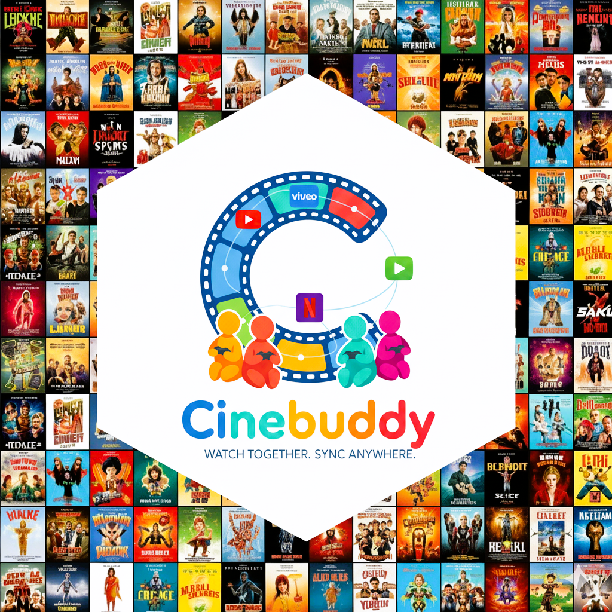

# CineBuddy



A browser extension that enables synchronized video playback across streaming services (YouTube,Vimeo etc.) with friends in real-time.

## Features

-  **Synchronized Playback**: Watch videos together with friends across different streaming platforms
-  **Real-time Chat**: Chat with friends while watching
-  **Video Calls**: WebRTC-powered video calls during watch parties
-  **Room Management**: Create and join virtual rooms (up to 15 users per room)
-  **Cross-Platform**: Works with Netflix, Hulu, YouTube, Disney+, Amazon Prime, and more
-  **Low Latency**: Sub-500ms sync for smooth viewing experience

## Architecture

- **Web Client**: React-based SPA served by Go backend
- **Chrome Extension**: Manifest V3 extension for DRM content (Netflix, Disney+, etc.)
- **Backend**: Go WebSocket server with persistent room state and chat history
- **Sync Protocol**: Real-time video event synchronization via WebSocket
- **Video Calls**: Peer-to-peer WebRTC connections with STUN servers
- **Cross-Platform**: Seamless integration between web client and extension

## Project Structure

```
CineBuddy/
├── src/
│   ├── extension/          # Chrome Extension (Manifest V3)
│   │   ├── background/     # Service Worker
│   │   ├── content/        # Content Scripts
│   │   ├── popup/          # Extension Popup UI
│   │   ├── components/     # Shared Components
│   │   └── manifest.json   # Extension Manifest
│   ├── web/               # React Web Client
│   │   ├── src/
│   │   │   ├── components/ # React Components
│   │   │   └── main.jsx    # App Entry Point
│   │   └── package.json    # Frontend Dependencies
│   └── server/            # Go Backend Server
│       ├── main.go        # WebSocket Server
│       └── go.mod         # Go Dependencies
├── assets/
│   └── icons/            # Logo and Assets
├── scripts/
│   └── build.js          # Build Script
└── dist/                 # Built Extension (Generated)
```

### System Architecture Diagram

```
┌─────────────────────────────────────────────────────────────────────────────────────────────────┐
│                                    CineBuddy Platform                                            │
│                              (Web Client + Extension + Backend)                                 │
└─────────────────────────────────────────────────────────────────────────────────────────────────┘
                                            │
                                            │
         ┌──────────────────────────────────┼──────────────────────────────────┐
         │                                  │                                  │
         ▼                                  ▼                                  ▼
┌─────────────────────┐          ┌─────────────────────┐          ┌─────────────────────┐
│   Web Client        │          │  Chrome Extension   │          │   Go Backend        │
│   (React SPA)       │          │   (Manifest V3)     │          │   (WebSocket)       │
│                     │          │                     │          │                     │
│ src/web/            │          │ src/extension/      │          │ src/server/         │
│ ├── components/     │          │ ├── background/     │          │ ├── main.go         │
│ ├── App.jsx         │          │ ├── content/        │          │ └── go.mod          │
│ └── package.json    │          │ ├── popup/          │          │                     │
│                     │          │ ├── components/     │          │ - Room Management   │
│ - Video Player      │          │ └── manifest.json   │          │ - WebSocket Server  │
│ - Chat Panel        │          │                     │          │ - REST API          │
│ - Video Grid        │          │ - Service Worker    │          │ - WebRTC Signaling  │
│ - Room Management   │          │ - Content Scripts   │          │ - Chat History      │
│ - WebRTC Calls      │          │ - DRM Site Support  │          │                     │
└─────────────────────┘          │ - Video Sync        │          └─────────────────────┘
         │                       │ - Chat Overlay      │                     │
         │                       │ - WebRTC Signaling  │                     │
         │                       └─────────────────────┘                     │
         │                                │                                  │
         │                                │                                  │
         └────────────────────────────────┼──────────────────────────────────┘
                                          │
                                          ▼
                              ┌─────────────────────────────┐
                              │     Communication Layer     │
                              │─────────────────────────────│
                              │                             │
                              │ WebSocket (ws://localhost)  │
                              │ ├── video-sync              │
                              │ ├── chat-message            │
                              │ ├── webrtc-offer/answer     │
                              │ ├── participant-joined/left │
                              │ └── room-update             │
                              │                             │
                              │ REST API (http://localhost) │
                              │ ├── /create-room (POST)     │
                              │ ├── /join-room (POST)       │
                              │ ├── /rooms (GET)            │
                              │ └── /join?room=<id> (GET)   │
                              └─────────────────────────────┘
                                          │
                                          ▼
                              ┌─────────────────────────────┐
                              │      Data Management        │
                              │─────────────────────────────│
                              │                             │
                              │ In-Memory Storage:          │
                              │ ├── rooms map[string]*Room  │
                              │ ├── clients map[string]*WS  │
                              │ ├── rateLimiter             │
                              │ └── ping checkers           │
                              │                             │
                              │ Room State:                 │
                              │ ├── VideoState (current)    │
                              │ ├── ChatHistory (last 100)  │
                              │ ├── Participants[]          │
                              │ └── LastActivity            │
                              └─────────────────────────────┘
                                          │
                                          ▼
                              ┌─────────────────────────────┐
                              │    External Integrations    │
                              │─────────────────────────────│
                              │                             │
                              │ WebRTC:                     │
                              │ ├── STUN Servers (Google)   │
                              │ ├── TURN Servers (Optional) │
                              │ └── P2P Video Calls         │
                              │                             │
                              │ DRM Platforms:              │
                              │ ├── Netflix, Disney+        │
                              │ ├── Amazon Prime, Hulu      │
                              │ ├── HBO Max, Paramount+     │
                              │ └── PeacockTV               │
                              └─────────────────────────────┘
```

## Sequence Diagram

```
───────────────────────────────  CineBuddy Watch Party Flow  ───────────────────────────────

Actors:
───────
WebClientA (Host)   React SPA at localhost:8080 (User A)
WebClientB (Joiner) React SPA at localhost:8080 (User B)
ExtensionA          Chrome Extension on DRM site (User A)
ExtensionB          Chrome Extension on DRM site (User B)
Go Backend Server   WebSocket + REST API server

Legend:
────────
→  : HTTP or WS message sent
←  : Response / event received
...: Parallel action
★  : Key event in flow

────────────────────────────────────────────────────────────────────────────────────────────

★ 1. ROOM CREATION (Web Client)
────────────────────────────────────────────────────────────────────────────────────────────
WebClientA         → POST /create-room { username: "Alice" }
Go Backend Server  ← 200 OK { roomId: "room_12345", shareLink: "http://localhost:8080/join?room=room_12345" }

WebClientA         → WS: { type: "join-room", roomId: "room_12345", username: "Alice" }
Go Backend Server  ← Adds Alice as host, stores room state
                    → WS to Alice: { type: "room-joined", data: {room, participants, videoState, chatHistory} }

────────────────────────────────────────────────────────────────────────────────────────────

★ 2. JOINING THE ROOM (Web Client)
────────────────────────────────────────────────────────────────────────────────────────────
WebClientB         → GET /join?room=room_12345
Go Backend Server  ← 200 OK { roomId: "room_12345" }

WebClientB         → WS: { type: "join-room", roomId: "room_12345", username: "Bob" }
Go Backend Server  ← Validates room + username
                    → WS to Bob: { type: "room-joined", data: {room, participants, videoState, chatHistory} }
                    → WS Broadcast to all:
                        { type: "participant-joined", data: { participant: Bob } }

WebClientA         ← Updates participant list in UI
WebClientB         ← Loads room state, video, and chat history

────────────────────────────────────────────────────────────────────────────────────────────

★ 3. EXTENSION INTEGRATION (DRM Sites)
────────────────────────────────────────────────────────────────────────────────────────────
ExtensionA (Netflix) → Detects video element on page
ExtensionA         → WS: { type: "join-room", roomId: "room_12345", username: "Alice" }
Go Backend Server  ← Validates existing room membership
                    → WS to ExtensionA: { type: "room-joined", data: {room, participants} }

ExtensionA         → window.postMessage to WebClientA: { action: "extensionReady", roomId: "room_12345" }
WebClientA         ← Updates UI to show "Extension Connected"

────────────────────────────────────────────────────────────────────────────────────────────

★ 4. VIDEO SYNC (Web Client → Extension)
────────────────────────────────────────────────────────────────────────────────────────────
WebClientA VideoPlayer → User plays video
WebClientA         → WS: { type: "video-sync", data: { currentTime: 120, paused: false, videoUrl: "..." } }
Go Backend Server  ← Updates room.CurrentVideo
                    → WS Broadcast: { type: "video-sync", data: {...} }

WebClientB         ← Updates local video player
ExtensionA         ← Receives via background.js → content.js
ExtensionA         → Applies sync to Netflix <video> element

────────────────────────────────────────────────────────────────────────────────────────────

★ 5. VIDEO SYNC (Extension → Web Client)
────────────────────────────────────────────────────────────────────────────────────────────
ExtensionA (Netflix) → User seeks to 5:30
ExtensionA         → chrome.runtime.sendMessage({ action: "videoSync", data: {...} })
ExtensionA Background → WS: { type: "video-sync", data: { currentTime: 330, paused: false } }
Go Backend Server  ← Updates room.CurrentVideo
                    → WS Broadcast: { type: "video-sync", data: {...} }

WebClientA         ← Updates video player position
WebClientB         ← Updates video player position

────────────────────────────────────────────────────────────────────────────────────────────

★ 6. CHAT EXCHANGE
────────────────────────────────────────────────────────────────────────────────────────────
WebClientB ChatPanel → User types "Great movie!"
WebClientB         → WS: { type: "chat-message", data: { username: "Bob", content: "Great movie!", timestamp: "..." } }
Go Backend Server  ← Validates + sanitizes message, stores in room.ChatHistory
                    → WS Broadcast: { type: "chat-message", data: {...} }

WebClientA         ← Displays message in chat panel
ExtensionA         ← Receives via background.js → content.js → chat overlay
ExtensionB         ← Receives via background.js → content.js → chat overlay

────────────────────────────────────────────────────────────────────────────────────────────

★ 7. WEBRTC CALL SETUP
────────────────────────────────────────────────────────────────────────────────────────────
WebClientA VideoGrid → User clicks "Start Video Call"
WebClientA         → getUserMedia() → Creates localStream
WebClientA         → WS: { type: "webrtc-offer", data: { to: "Bob", offer: {...}, roomId: "room_12345" } }

Go Backend Server  ← Validates room access, forwards to Bob
WebClientB         ← Receives { type: "webrtc-offer" }
WebClientB         → Sets remoteDescription → createAnswer()
WebClientB         → WS: { type: "webrtc-answer", data: { to: "Alice", answer: {...}, roomId: "room_12345" } }

Go Backend Server  ← Forwards to Alice
WebClientA         ← Receives answer → sets remoteDescription
Both clients exchange ICE candidates via webrtc-ice-candidate messages

Peer-to-peer connection established
Local and remote video streams appear in VideoGrid component

────────────────────────────────────────────────────────────────────────────────────────────

★ 8. KEEP-ALIVE & RATE LIMITING
────────────────────────────────────────────────────────────────────────────────────────────
Every 30s:
WebClientA         → WS: { type: "ping" }
ExtensionA         → WS: { type: "ping" }
Go Backend Server  ← Updates lastPing[clientID]
If inactive >60s:
  → closes connection, removes from clients map

Video-sync events:
  → Limited to 5 per second per client via rateLimiter + content.js throttle

────────────────────────────────────────────────────────────────────────────────────────────

★ 9. DISCONNECTION / CLEANUP
────────────────────────────────────────────────────────────────────────────────────────────
WebClientB closes tab:
Go Backend Server  ← Detects closed socket, removes participant
                    → WS Broadcast: { type: "participant-left", data: { participantId: "Bob" } }

WebClientA         ← Updates participant list
ExtensionA         ← Updates participant list in overlay

If room empty → server deletes room entry from memory

────────────────────────────────────────────────────────────────────────────────────────────

★ 10. BACKEND RESTART
────────────────────────────────────────────────────────────────────────────────────────────
All data wiped (stateless by design)
WebClientA         → Detects WS disconnect → tries reconnect (with backoff)
ExtensionA         → Detects WS disconnect → tries reconnect (with backoff)
On reconnect:
  → WS: { type: "join-room", roomId: "room_12345", username: "Alice" }

Server rebuilds room state dynamically from reconnecting clients.
────────────────────────────────────────────────────────────────────────────────────────────
```

## Quick Start

### Prerequisites

- Node.js 18+ and npm
- Go 1.21+
- Chrome or Firefox browser

### Installation

1. **Clone the repository**
   ```bash
   git clone <repository-url>
   cd cinebuddy
   ```

2. **Install dependencies**
   ```bash
   npm install
   ```

3. **Build the extension**
   ```bash
   npm run build-extension
   ```

4. **Start the backend server**
   ```bash
   npm run start-backend
   ```

5. **Load the extension in your browser**
   - Chrome: Go to `chrome://extensions/`, enable Developer mode, click "Load unpacked", select the `dist` folder
   - Firefox: Go to `about:debugging`, click "This Firefox", click "Load Temporary Add-on", select `dist/manifest.json`

### Development

1. **Start development mode**
   ```bash
   # Terminal 1: Watch for changes and rebuild
   npm run dev
   
   # Terminal 2: Start backend server
   npm run dev-backend
   ```

2. **Reload the extension** in your browser after making changes

## Usage

### Web Client (Primary Interface)
1. **Access the web client** at `http://localhost:8080`
2. **Create or join a room** with your username
3. **Paste video URLs** (YouTube, Vimeo, etc.) to watch together
4. **Use chat and video calls** to communicate with friends
5. **Share room links** with friends to invite them

### Chrome Extension (DRM Content)
1. **Install the extension** in Chrome
2. **Navigate to DRM sites** (Netflix, Disney+, Prime Video, etc.)
3. **The extension automatically connects** to active CineBuddy rooms
4. **Video sync and chat work seamlessly** between web client and extension

## Supported Platforms

- Netflix
- Hulu
- YouTube
- Disney+
- Amazon Prime Video
- HBO Max
- Generic HTML5 video players

## Technical Details

### Extension Structure
```
extension/
├── popup/           # React popup UI
├── content/         # Video detection and sync
├── background/      # Service worker
├── components/      # Shared UI components
└── manifest.json    # Extension manifest
```

### Backend API

**WebSocket Endpoints:**
- `ws://localhost:8080/ws` - Main WebSocket connection

**REST Endpoints:**
- `POST /create-room` - Create a new room
- `POST /join-room` - Join an existing room
- `GET /rooms` - List all rooms
- `GET /health` - Health check

### WebSocket Message Types

- `join-room` - Join a room
- `leave-room` - Leave a room
- `video-sync` - Video playback synchronization
- `chat-message` - Chat messages
- `participant-joined` - New participant notification
- `participant-left` - Participant left notification

## Configuration

### Backend Configuration
- **Port**: 8080 (configurable in `backend/main.go`)
- **Max Rooms**: 5 concurrent rooms
- **Max Users per Room**: 15 users
- **CORS**: Enabled for all origins (development)

### Extension Configuration
- **Supported Sites**: Configured in `manifest.json`
- **Permissions**: Active tab, storage, scripting
- **Host Permissions**: All supported streaming sites

## Security & Privacy

- **No DRM Circumvention**: Uses companion mode for protected content
- **Ephemeral Data**: No persistent storage, all data cleared on restart
- **TLS Required**: Secure WebSocket connections
- **Minimal Permissions**: Only necessary browser permissions

## Limitations

- Maximum 15 users per room
- Maximum 5 concurrent rooms (75 total users)
- No persistent data storage
- Requires active internet connection
- Some streaming services may have restrictions

## Troubleshooting

### Common Issues

1. **Extension not loading**
   - Check browser console for errors
   - Ensure all files are built correctly
   - Verify manifest.json is valid

2. **Backend connection failed**
   - Check if backend server is running on port 8080
   - Verify firewall settings
   - Check browser console for WebSocket errors

3. **Video sync not working**
   - Ensure all participants are in the same room
   - Check if video is detected on the page
   - Verify WebSocket connection is active

### Debug Mode

Enable debug logging by opening browser developer tools and checking the console for detailed logs.

## Contributing

1. Fork the repository
2. Create a feature branch
3. Make your changes
4. Test thoroughly
5. Submit a pull request

## License

MIT License - see LICENSE file for details

## Manual Testing Guide

### Prerequisites Setup
1. **Install Go dependencies**
   ```bash
   cd src/server
   go mod tidy
   ```

2. **Install Node.js dependencies**
   ```bash
   npm install
   ```

3. **Build the extension**
   ```bash
   npm run build
   ```

### Step 1: Load Chrome Extension
1. **Open Chrome Extensions page**
   - Go to `chrome://extensions/`
   - Enable "Developer mode" (toggle in top-right)

2. **Load the extension**
   - Click "Load unpacked"
   - Navigate to `F:\RESUME\Assignments\CineBuddy\dist` folder
   - Select the folder and click "Select Folder"

3. **Verify extension loaded**
   - You should see "CineBuddy" extension in the list
   - Pin the extension to your toolbar (click the puzzle piece icon)
   - The CineBuddy icon should appear in your toolbar

### Step 2: Start Backend Server
1. **Open PowerShell/Terminal**
   ```bash
   cd src/server
   go run main.go
   ```

2. **Verify server started**
   - You should see: "Starting CineBuddy server on port 8080"
   - Database should be created: "Database: ./cinebuddy.db"
   - Server should show: "Loaded X rooms from database"

### Step 3: Test Web Client
1. **Open web client**
   - Go to `http://localhost:8080` in Chrome
   - You should see the CineBuddy landing page

2. **Create a room**
   - Enter username: "TestUser1"
   - Click "Create Room"
   - You should see a room page with video player and chat

3. **Test video playback**
   - Paste a YouTube URL (e.g., `https://www.youtube.com/watch?v=dQw4w9WgXcQ`)
   - Click "Load" button
   - Video should start playing

### Step 4: Test Extension Integration
1. **Open a DRM site**
   - Go to Netflix, Disney+, or Prime Video
   - The extension should automatically detect the page

2. **Check extension status**
   - Click the CineBuddy extension icon in toolbar
   - You should see "Extension Connected" or connection status
   - The popup should show room information

3. **Test video sync from extension**
   - Play a video on the DRM site
   - Check if the web client video syncs (if in same room)
   - The extension should show sync indicators

### Step 5: Test Cross-Platform Sync
1. **Open second browser tab**
   - Go to `http://localhost:8080` in a new tab
   - Join the same room with username "TestUser2"

2. **Test bidirectional sync**
   - Play video in web client → should sync to extension
   - Play video in extension → should sync to web client
   - Test play/pause/seek in both directions

### Step 6: Test Chat Functionality
1. **Web client chat**
   - Send messages from web client chat panel
   - Messages should appear in real-time

2. **Extension chat**
   - Click the chat button in extension popup
   - Send messages from extension
   - Messages should appear in web client

### Step 7: Test WebRTC Video Calls
1. **Start video call**
   - In web client, click "Start Video Call"
   - Allow camera/microphone permissions
   - Video call interface should appear

2. **Test call features**
   - Mute/unmute microphone
   - Turn video on/off
   - End call functionality

### Step 8: Test Room Persistence
1. **Restart backend server**
   - Stop the Go server (Ctrl+C)
   - Start it again: `go run main.go`
   - Server should restore previous rooms

2. **Rejoin room**
   - Refresh the web client page
   - Rejoin the same room
   - Chat history should be restored

### Step 9: Test Error Handling
1. **Network disconnection**
   - Disconnect internet briefly
   - Extension should show "Reconnecting..." status
   - Reconnect and verify sync resumes

2. **Invalid room ID**
   - Try joining a non-existent room
   - Should show appropriate error message

### Expected Results ✅
- **Extension loads successfully** in Chrome
- **Web client accessible** at localhost:8080
- **Video sync works** between web client and extension
- **Chat messages** appear in real-time across platforms
- **WebRTC calls** work with camera/microphone
- **Room persistence** survives server restarts
- **Error handling** works gracefully

### Troubleshooting
- **Extension not loading**: Check if `dist` folder exists and has manifest.json
- **Server won't start**: Ensure port 8080 is not in use
- **Video not syncing**: Check browser console for WebSocket errors
- **Chat not working**: Verify WebSocket connection is active
- **WebRTC not working**: Check camera/microphone permissions

### Debug Tips
- Open Chrome DevTools (F12) to see console logs
- Check extension popup for connection status
- Monitor network tab for WebSocket connections
- Use `chrome://extensions/` to reload extension after changes

## Support

For issues and questions:
- Check the troubleshooting section
- Open an issue on GitHub
- Review the project documentation

---

**Note**: This extension is for educational and personal use. Please respect the terms of service of streaming platforms and use responsibly.
